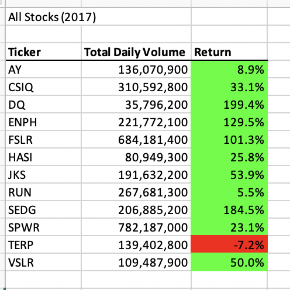
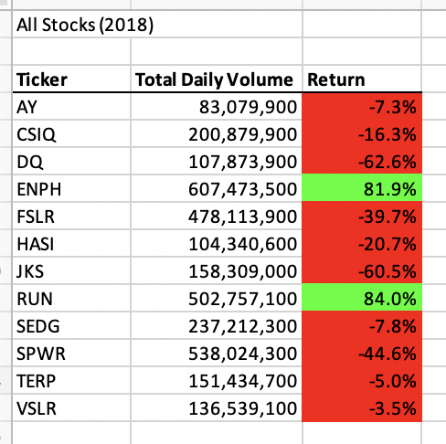
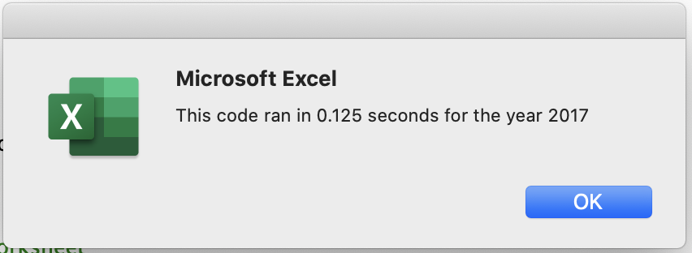
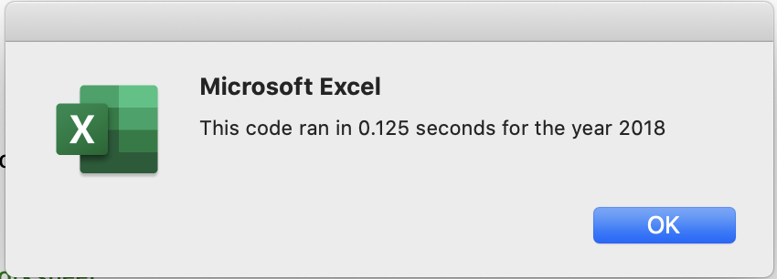

# An Analysis of the green stocks performance in 2017 and 2018
## Overview of Project
### Purpose
The purpose of this project is using VBA code to analyse and compare the performance of 12 stocks in 2017 and 2018. The result will help to build the fund.

## Results

## Summary
### advantages and disadvantages of refactoring code in general 
### advantages and disadvantages of the original and refactored VBA script
